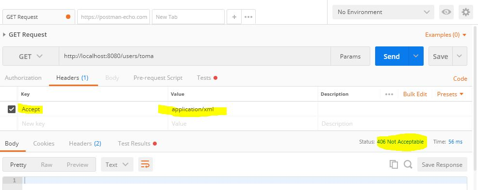
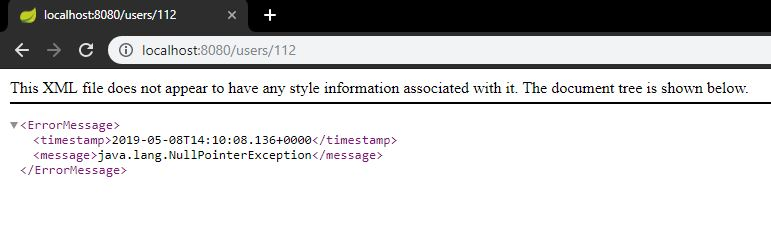

# RESTful Web Services with Spring Framework
* A quick start to building your REST API with Spring Boot and Spring MVC
* https://www.udemy.com/restful-web-services-with-spring-framework-a-quick-start/
<hr>
**Contents**
<!-- TOC depthFrom:2 depthTo:6 withLinks:1 updateOnSave:1 orderedList:0 -->

- [1. Introduction](#1-introduction)
	- [Source code](#source-code)
	- [Download and install Postman HTTP client](#download-and-install-postman-http-client)
	- [Postman overview](#postman-overview)
	- [Resource and Collection URIs](#resource-and-collection-uris)
	- [HTTP Methods: GET, POST, DELETE and PUT](#http-methods-get-post-delete-and-put)
	- [HTTP Headers: accept and content type](#http-headers-accept-and-content-type)
- [2. Setting up development environment](#2-setting-up-development-environment)
- [3. Creating a New Project](#3-creating-a-new-project)
- [4. Create RESTful Web Service endpoints](#4-create-restful-web-service-endpoints)
	- [Create users Rest controller class](#create-users-rest-controller-class)
	- [Adding methods to handle POST, GET, PUT, DELETE HTTP request](#adding-methods-to-handle-post-get-put-delete-http-request)
	- [Running web service application](#running-web-service-application)
- [5. Handle HTTP GET Request](#5-handle-http-get-request)
	- [Reading path variables with @PathVariable annotation](#reading-path-variables-with-pathvariable-annotation)
	- [Reading query string request parameters with @RequestParam annotation](#reading-query-string-request-parameters-with-requestparam-annotation)
	- [Making parameters optional or required](#making-parameters-optional-or-required)
- [6. Returning a Response](#6-returning-a-response)
	- [Returning Java object as return value](#returning-java-object-as-return-value)
	- [Returning object as json or xml representation](#returning-object-as-json-or-xml-representation)
	- [Set response status code](#set-response-status-code)
- [7. Handle HTT POST Request](#7-handle-htt-post-request)
- [@RequestBody](#requestbody)
- [Validating HTTP POST Request Body](#validating-http-post-request-body)
- [8. Handle HTTP PUT and HTTP Delete Request](#8-handle-http-put-and-http-delete-request)
	- [Store users temporary](#store-users-temporary)
	- [Handle HTTP PUT request](#handle-http-put-request)
	- [Handle HTTP Delete request](#handle-http-delete-request)
- [9. Exception Handling](#9-exception-handling)
	- [Handle an exception](#handle-an-exception)
	- [Return custom error message object](#return-custom-error-message-object)
	- [Handle a specific exception](#handle-a-specific-exception)
	- [Throw and handle your own custom exception](#throw-and-handle-your-own-custom-exception)
	- [Catch more than one exception with one method](#catch-more-than-one-exception-with-one-method)
- [10. Dependency Injection](#10-dependency-injection)
- [11. Standalone Application](#11-standalone-application)
- [12. Bonus: Password Reset, Email Verification, Security](#12-bonus-password-reset-email-verification-security)
- [Contats details](#contats-details)

<!-- /TOC -->


## 1. Introduction
### Source code
>https://github.com/simplyi/mobile-app-ws-quick-start
### Download and install Postman HTTP client
### Postman overview
* Console
* Source
### Resource and Collection URIs
URL:
> http://www.yourwebsiteaddress.com/api/users/?start=1&limit=50  
* Protocol: **HTTP**
* Domain and web site address: **www.yourwebsiteaddress.com**
* URI: **/api/users/**
* Query string: **?start=1&limit=50**


* HTTP Methods, in REST action is not in the URI name

|Traditional | REST|
|:---------------|:----------------|
| GET /GetUserDetailsServlet?userId=1 |GET /users/1|
| GET /DeleteUserDetailsServlet?userId=1 |DELETE /users/1|
| GET /UpdateUserDetailsServlet <br>{"name":"James"...} |PUT /users/1|
| GET /GetAllUsersServlet |GET /users|
| GET /GetAllUsersServlet?userId=1 |GET /users/1|
| GET /GetMessageComments?userId=1&messageId=5 |GET /users/1/messages/5/comments|
| GET /GetMessageComments?userId=1&messageId=5&commentId=1 |GET /users/1/messages/5/comments/1|

Naming Tips
* **Nouns** as opposed to verbs or actions. Ex. /users vs /getUsers
* **Plurals**: ex /users/1 vs /user/1
* **Predictable**
    * /users/1/messages vs /users/1/publishedMessages/
    * /users/1/messages/2/likes vs /users/1/publishedMessages/2/allLikes

### HTTP Methods: GET, POST, DELETE and PUT
* POST - Create user. /users
* GET - Read user details. /users/1
* PUT - Update user details. /users/1
* DELETE - Delete user details. /users/1

### HTTP Headers: accept and content type
* What type of content post contains in its body.
* If **response** body is in JSON format: Postman > headers tab > add header key:**Content-Type** and value:**application/json**
* If content of **request** is JSON add Header: **Accept** and value **application/json**


## 2. Setting up development environment  
* Install Java Platform (JDK)
* Download and Install Spring Tool Suit (STS)

## 3. Creating a New Project
* Create new Spring Boot Project with Spring Tool Suite
* Create a new spring project using Spring Boot Initializr

## 4. Create RESTful Web Service endpoints
### Create users Rest controller class
* Create class, add **@RestController** and **@RequestMapping**
```java
import org.springframework.web.bind.annotation.RequestMapping;
import org.springframework.web.bind.annotation.RestController;

@RestController
@RequestMapping("/users")
public class UserController {

}
```

### Adding methods to handle POST, GET, PUT, DELETE HTTP request
```java
@GetMapping
public String get() { return "GET"; }

@PostMapping
public String create() { return "create"; }

@PutMapping
public String update() { return "update"; }

@DeleteMapping
public String delete() { return "delete"; }
```
### Running web service application

## 5. Handle HTTP GET Request
### Reading path variables with @PathVariable annotation
```java
@GetMapping("/{userId}")
public String get(@PathVariable String userId) {
    return "GET " + userId;
}
```

### Reading query string request parameters with @RequestParam annotation
```java
@GetMapping
public String get(@RequestParam(name = "page") Integer page, @RequestParam Integer limit) {
    return "GET: page " + page + " limit " + limit;
}
```

### Making parameters optional or required
* Using **optional** and **default** attributes of @RequestParam

## 6. Returning a Response
### Returning Java object as return value
* Create a bean and return this bean.

### Returning object as json or xml representation
* By default get methods return json

* To be able to accept xml
    1. Add **Jackson** dataformat dependency.
    ```xml
    <dependency>
        <groupId>com.fasterxml.jackson.dataformat</groupId>
        <artifactId>jackson-dataformat-xml</artifactId>
        <version>2.9.8</version>
    </dependency>    
    ```
    2. Config method to be able to return xml, add **produces** attribute:
    ```java
    @GetMapping(value = "/{userId}", produces = {
          MediaType.APPLICATION_XML_VALUE, MediaType.APPLICATION_JSON_VALUE})
    public UserRest get(@PathVariable String userId) {
        return new UserRest("Toni", "Diaz Arroyo", "antonio.diaz.arroyo@gmail.com", "1a");
    }    
    ```
### Set response status code
* Use **ResponseEntity**
* Review response status codes: https://developer.mozilla.org/es/docs/Web/HTTP/Status
* Return: **400 Bad Request**
```java
@GetMapping(value = "/{userId}", produces = {MediaType.APPLICATION_XML_VALUE, MediaType.APPLICATION_JSON_VALUE})
public ResponseEntity<UserRest> get(@PathVariable String userId) {
    return new ResponseEntity<>(HttpStatus.BAD_REQUEST);
}
```

## 7. Handle HTT POST Request
## @RequestBody
```java
@PostMapping(
        consumes = {MediaType.APPLICATION_XML_VALUE, MediaType.APPLICATION_JSON_VALUE},
        produces = {MediaType.APPLICATION_XML_VALUE, MediaType.APPLICATION_JSON_VALUE})
public ResponseEntity<UserRest> create(@RequestBody UserRest userRest) {
    return new ResponseEntity<>(HttpStatus.BAD_REQUEST);
}
```
## Validating HTTP POST Request Body
* Post explining validations: http://appsdeveloperblog.com/validate-request-body-in-restful-web-service/
* Hibernate validations: http://docs.jboss.org/hibernate/stable/validator/reference/en-US/html_single/#validator-defineconstraints-spec
* Enable Validation: add **@Valid** in post method.
```java
@PostMapping(
        consumes = {MediaType.APPLICATION_XML_VALUE, MediaType.APPLICATION_JSON_VALUE},
        produces = {MediaType.APPLICATION_XML_VALUE, MediaType.APPLICATION_JSON_VALUE})
public ResponseEntity<UserRest> create(@Valid @RequestBody UserRest userRest) {
    System.out.println(userRest);
    userRest.setUserId("");
    return new ResponseEntity<>(userRest, HttpStatus.OK);
}
```
* Add validations to attributes in entity class.
```java
package com.adiaz.mobileappws.model;

import lombok.AllArgsConstructor;
import lombok.Data;
import lombok.NoArgsConstructor;

import javax.validation.constraints.Email;
import javax.validation.constraints.NotEmpty;
import javax.validation.constraints.NotNull;
import javax.validation.constraints.Size;

@Data
@AllArgsConstructor
@NoArgsConstructor
public class UserRest {
    @NotNull(message = "First name cannot be null")
    @Size(min = 2, max = 30, message = "First name incorrect.")
    @NotEmpty
    private String firstName;

    @NotNull(message = "Last name cannot be null")
    private String lastName;

    @NotNull(message = "Email cannot be null")
    @Email(message = "Email format incorrect")
    private String email;

    @NotNull(message = "Password cannot be null")
    @Size(min=8, max = 16, message = "Password size incorrect.")
    private String userId;
}
```
## 8. Handle HTTP PUT and HTTP Delete Request
### Store users temporary
* Create a map in controller to save user.

### Handle HTTP PUT request
```java
@PutMapping(
        path = "/{userId}",
        consumes = {MediaType.APPLICATION_XML_VALUE, MediaType.APPLICATION_JSON_VALUE},
        produces = {MediaType.APPLICATION_XML_VALUE, MediaType.APPLICATION_JSON_VALUE})
public ResponseEntity<UserRest> update(@PathVariable String userId, @Valid @RequestBody UserRestUpdate userRestUpdate) {
    if(!usersMap.containsKey(userId))
        return new ResponseEntity<>(HttpStatus.NO_CONTENT);
    UserRest userRest = usersMap.get(userId);
    userRest.setFirstName(userRestUpdate.getFirstName());
    userRest.setLastName(userRestUpdate.getLastName());
    return new ResponseEntity<>(userRest, HttpStatus.OK);
}
```
### Handle HTTP Delete request
```java
@DeleteMapping(path = "/{userId}")
public ResponseEntity<Void> delete(@PathVariable String userId) {
    usersMap.remove(userId);
    return ResponseEntity.noContent().build();
}
```
## 9. Exception Handling
### Handle an exception
* Create class extends **ResponseEntityExceptionHandler**
* Annotate class with **@ControllerAdvice**
* Create method and annotate it with **@ExceptionHandle**
```java
import org.springframework.http.HttpHeaders;
import org.springframework.http.HttpStatus;
import org.springframework.http.ResponseEntity;
import org.springframework.web.bind.annotation.ControllerAdvice;
import org.springframework.web.bind.annotation.ExceptionHandler;
import org.springframework.web.context.request.WebRequest;
import org.springframework.web.servlet.mvc.method.annotation.ResponseEntityExceptionHandler;

@ControllerAdvice
public class AppExceptionHandler extends ResponseEntityExceptionHandler {

    @ExceptionHandler(value = {Exception.class})
    public ResponseEntity<Object> handleAnyTypeException(Exception ex, WebRequest request) {
        return new ResponseEntity<>(ex, new HttpHeaders(), HttpStatus.INTERNAL_SERVER_ERROR);
    }
}
```
### Return custom error message object

* Create bean to map our custom error  
```java
@Data
@AllArgsConstructor
@NoArgsConstructor
public class ErrorMessage {
    private Date timestamp;
    private String message;
}
```
* Use our custom from our Error Handler
```java
@ControllerAdvice
public class AppExceptionHandler extends ResponseEntityExceptionHandler {
    @ExceptionHandler(value = {Exception.class})
    public ResponseEntity<Object> handleAnyTypeException(Exception ex, WebRequest request) {
        String errorMsgDesc = ex.getLocalizedMessage()!=null ? ex.getLocalizedMessage() : ex.toString();
        ErrorMessage errorMessage = new ErrorMessage(new Date(), errorMsgDesc);
        return new ResponseEntity<>(errorMessage, new HttpHeaders(), HttpStatus.INTERNAL_SERVER_ERROR);
    }
}
```
### Handle a specific exception
* Create a method to handler **NullPointerException**
```java
    @ExceptionHandler(value = {NullPointerException.class})
    public ResponseEntity<Object> handleNullPointerException(NullPointerException ex, WebRequest request) {
        String errorMsgDesc = "NPE: " +  (ex.getLocalizedMessage()!=null ? ex.getLocalizedMessage() : ex.toString());
        ErrorMessage errorMessage = new ErrorMessage(new Date(), errorMsgDesc);
        return new ResponseEntity<>(errorMessage, new HttpHeaders(), HttpStatus.INTERNAL_SERVER_ERROR);
    }
}
```
### Throw and handle your own custom exception
* Create a class that extends **RuntimeException**
```java
public class UserServiceException extends RuntimeException {
    public UserServiceException(String msg) {
        super(msg);
    }
}
```
* Create a method to handle the new custom Exception.
```java
    @ExceptionHandler(value = {UserServiceException.class})
    public ResponseEntity<Object> handleUserServiceException(UserServiceException ex, WebRequest request) {
        String errorMsgDesc = "USER_SERVICE_EXCEPTION: " +  (ex.getLocalizedMessage()!=null ? ex.getLocalizedMessage() : ex.toString());
        ErrorMessage errorMessage = new ErrorMessage(new Date(), errorMsgDesc);
        return new ResponseEntity<>(errorMessage, new HttpHeaders(), HttpStatus.INTERNAL_SERVER_ERROR);
    }
```
### Catch more than one exception with one method
```java
    @ExceptionHandler(value = {NullPointerException.class, UserServiceException.class})
    public ResponseEntity<Object> handleSpecificException(Exception ex, WebRequest request) {
        String errorMsgDesc = "SPECIFIC: " +  (ex.getLocalizedMessage()!=null ? ex.getLocalizedMessage() : ex.toString());
        ErrorMessage errorMessage = new ErrorMessage(new Date(), errorMsgDesc);
        return new ResponseEntity<>(errorMessage, new HttpHeaders(), HttpStatus.INTERNAL_SERVER_ERROR);
    }
```
## 10. Dependency Injection
* Create interface.
```java
public interface UserService {
    UserRest createUser(UserRest userRest);
}
```
* Create class and annotate it with **@Service**
```java
@Service
public class UserServiceImpl implements UserService {
    @Override
    public UserRest createUser(UserRest userRest) {
        String userId = UUID.randomUUID().toString();
        userRest.setUserId(userId);
        DataBase.USER_MAP.put(userId, userRest);
        return userRest;
    }
}
```
* Inject the service in the controller.
```java
@Autowired
UserService userService;
```
* Inject bean using constructor:
```java

@Service
public class UserServiceImpl implements UserService {
    Utils utils;

    public UserServiceImpl() {}

    @Autowired
    public UserServiceImpl(Utils utils) {
        this.utils = utils;
    }
}
```
## 11. Standalone Application
>mvn install -> compile, run test and generate jar file inside target folder.  

>java -jar target/myjarfile.jar

>mvn clean -> remove target folder.

## 12. Bonus: Password Reset, Email Verification, Security
* User sing-up
* User sing-in
* Secure your RESTful Web Service application
* Token-based authentication
* Passowrd reset functionality
* Email verification functionality
* Download & Install MySQL Server and Spring Data JPA Framework
* H2 in-memory database
* Learn how to test your code with Junit and Rest Assured frameworks.
* Start your own AWS EC2 Linux Server in Amazon Cloud.
* Deploy REST API in Amazon Cloud.

Have a coupon? LOWEST_PRICE

## Contats details
I am always happy to make new friends! :)

If you would like to stay in touch, I have an Instagram and Twitter accounts where I often post behind the scenes photos as well as blog posts and video tutorials which I produce every single day.

To stay in touch on Instagram, find me by: appsdeveloperblog

To stay in touch on Twitter, find me by: @kargopolov

I also post a lot of video tutorials on YouTube: https://www.youtube.com/user/sergeykargopolov and a lot of code examples on my blog appsdeveloperblog.com

Sergey
